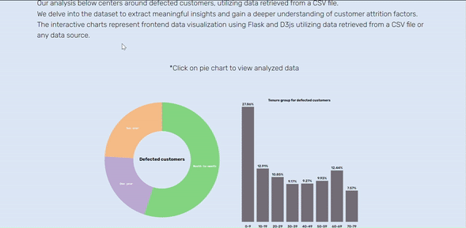

# Data Vibe⚡
## Interactive data visualization using Flask and D3js

* Welcome to Data Vibe⚡ </br>
This is an interactive and responsive data visualization software that involves the process of typically retrieving data from a data source, such as a database or an API, using Flask's data handling capabilities. 
The retrieved data is then transformed, filtered, or processed as needed. Flask's templating engine allows seamless integration of data into the HTML structure of the visualization.

* Once the data is prepared, D3.js comes into play </br>
Using its powerful data binding and manipulation capabilities, the software creates interactive visualizations by mapping the data to various visual elements. 
D3.js provides a wide range of tools for creating interactive features like tooltips, zooming, panning, and animations, allowing users to explore and interact with the visualized data in meaningful ways.


## :warning: Prerequisites

* Must have `git` installed.

* Must have repository cloned.

```
$ sudo apt-get install git
```


## :arrow_down: Installing and Using

Clone the repository into a new directory:

```
$ git clone https://github.com/jannelson36/Data-Vibe.git
```
Begin by creating a virtual Python environment:

```
pip install virtualenv
```

Navigate to the project root folder and create the virtual environment:

```
virtualenv flask
```

The virtual environment must be activated before you can install packages. In the project root folder, execute:

```
source flask/bin/activate
```

Install Flask from your terminal using the following command:

```
pip install Flask
```

Install the Pandas library:

```
pip install pandas
```

Install the NumPy library:

```
pip install numpy
```

Run the following command to generate a requirements.txt file that contains the project dependencies:

```
pip freeze > requirements.txt
```

If you’d prefer to fetch the file from the [requirements.txt](./requirements.txt) file found in the GitHub repository for this project, run the following command after copying the content of the file in the repo to your project:

```
pip install -r requirements.txt
```

Upon successfully installing the required Python packages, you can proceed to set the project file structure and required files as shown below:
```
.
├── README.md
├── app.py
├── flask
├── requirements.txt
├── static
│   ├── css
│   ├── data
│   ├── js
│   └── logo.jpeg
└── templates
    └── index.html
```

## :clipboard: Example




## :blue_book: Author

* **Jan Nelson** - [@jannelson36](https://github.com/jannelson36)


## :mag: License

This project is licensed under the MIT License - see the [LICENSE.md](LICENSE.md) file for details

